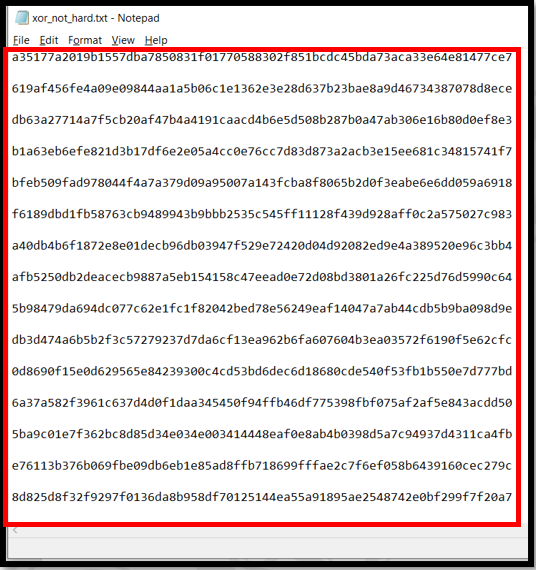
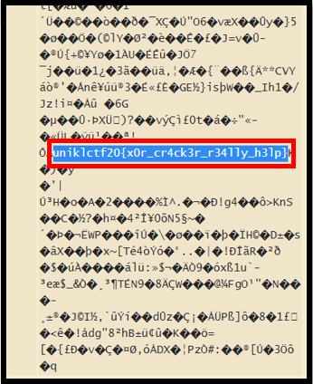

#### Points: 20  

#### File [xor not hard.txt](xor_not_hard.txt)

#### Description: Could you decipher the message?
---  
#### _Write-up_
In this challenge, I was given xor_not_hard.txt which is a text file. This file contains many ciphers as shown below.

I use this link https://www.dcode.fr/xor-cipher to decipher the message and found the flag as shown below. 

#### The flag of this challenge is uniklctf20{x0r_cr4ck3r_r34lly_h3lp}
