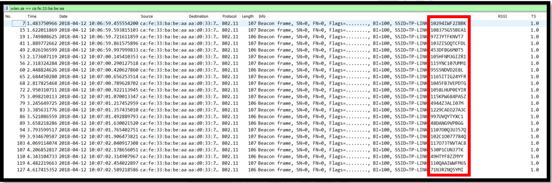
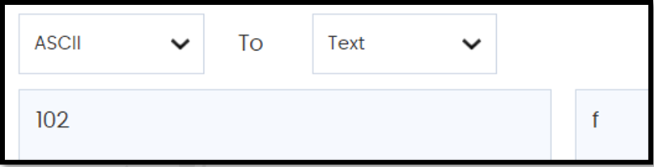
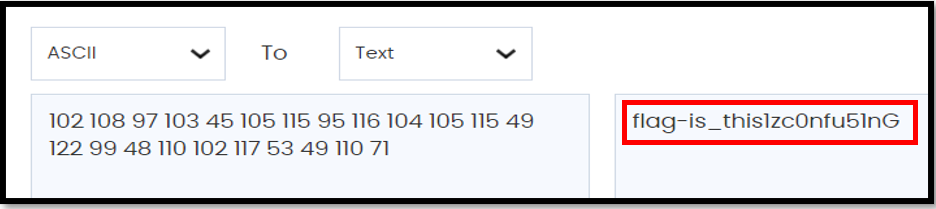

#### Points: 40

#### File : [can_u_hear_me.pcapng](can_u_hear_me.pcapng)

#### Description: We intercept this network traffic within our network. Can you help us and analyse it?

#### _Write-up_

In this challenge, I was given can_u_hear_me.pcapng file.
I use wireshark to find the flag. As shown in figure below, I see too many SSID with different serial number on TP Link. So, I filter using wlan.sa == ca:fe:33:ba:be:aa which is filter by source address.

I try decoding using many decoders but get nothing. So, I try decoding by using ASCII. As ASCII using max 3 letter, I try to ASCII the first 3 character and I found something that will lead to the flag. Below show what I found.

After a few trial and error, I got the result as shown below.

#### The flag of this challenge is ctfunikl20{this1zc0nfu51nG}
