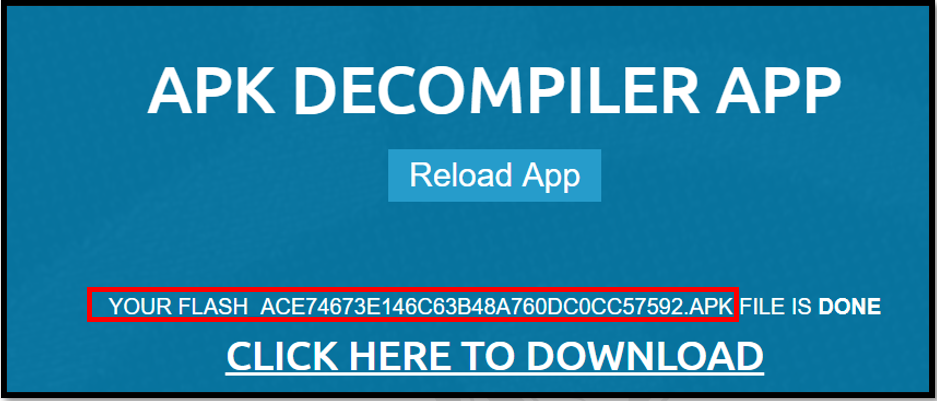
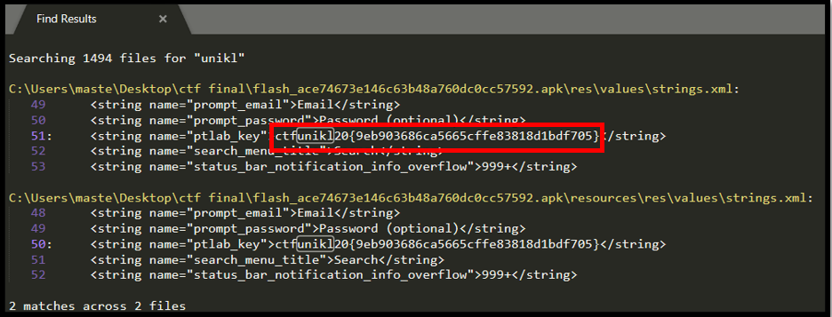

#### Points: 60

#### File : [flash_ace74673e146c63b48a760dc0cc57592.apk](flash_ace74673e146c63b48a760dc0cc57592.apk)
---
#### _Write-up_

In this challenge I was given superman_2a44825161447db9fac5276beff6b3a9.apk file.
I use this link https://www.apkdecompilers.com/ to decompile the apk file.

In the figure above shows that I get a zip file after decompiling the apk file.
I use Sublime Text and I use “unikl” as the keyword to find the flag.

In the figure above shows the flag in strings.xml file.
#### The flag of this challenge is ctfunikl20{9eb903686ca5665cffe83818d1bdf705}

