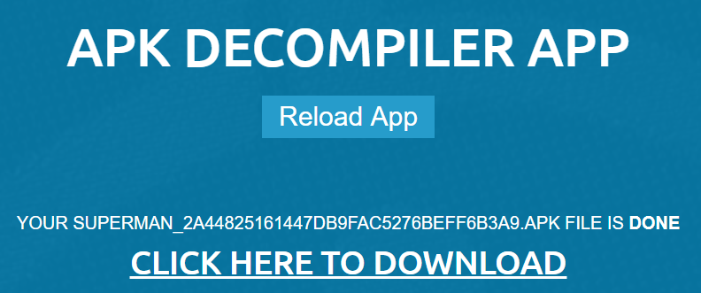
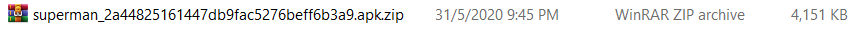
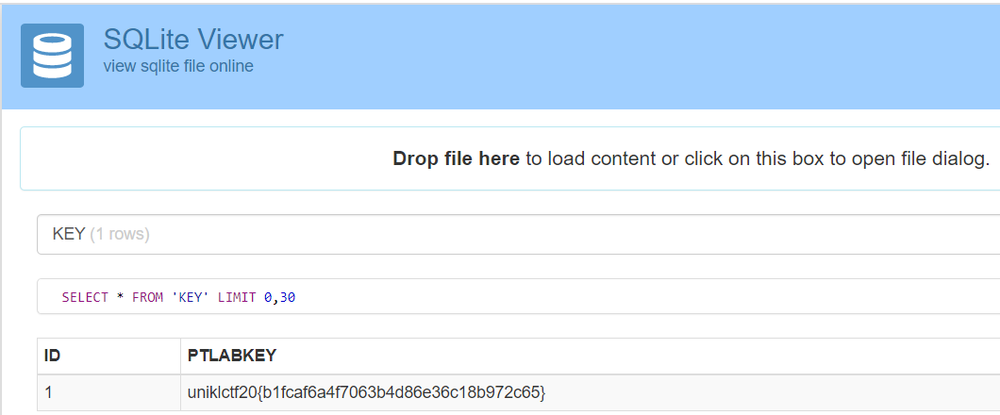

#### Points: 40
---
#### _Write-up_
In this challenge, I was given superman_2a44825161447db9fac5276beff6b3a9.apk file. 
I use this link https://www.apkdecompilers.com/ to decompile the apk file. 

In the figure above shows that I get a zip file after decompiling the apk file.
After extract the zip file, I see the data.sqlite file in the asset folder. I use this link http://inloop.github.io/sqlite-viewer/ to view the sqlite file and I found the flag.

#### The flag of this challenge is uniklctf20{b1fcaf6a4f7063b4d86e36c18b972c65}
