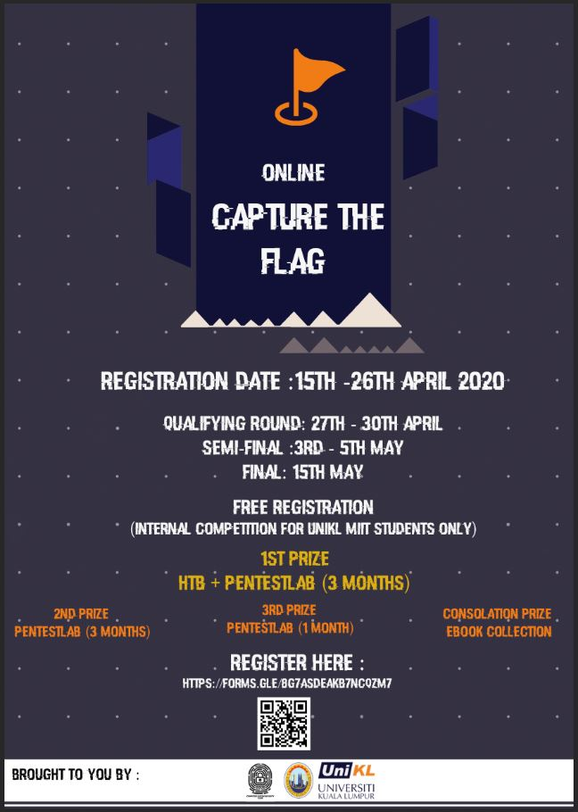
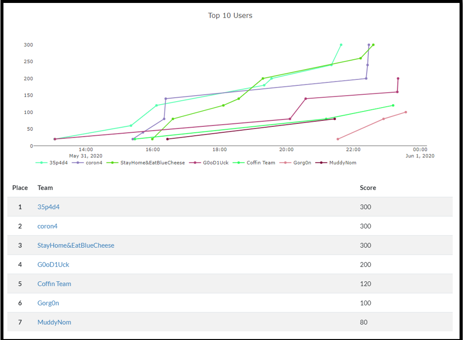

# UNIKL MIIT ONLINE CTF 2020 Writeup

## CONGRATULATION TO TOP 10 FINALIST

Capture the Flag Hacking Competition - UniKL MIIT 2020 organized by Computer System Security Club (CSSC) to create new exposure for students of MIIT regarding information security.

Due to the government Restriction Movement Order (RMO), this competition will be conducted based on Online Format only. The details regarding this competition as the following:

Final Round : 31st May 2020

Game time : 9:00 AM - 12:00 AM

Scoreboard will be Freeze at : 10:00 PM

### Terms and Condition : -

1. For this competition, students can participate as an Individual or Team. For Team, each team consists of TWO (2) students.

2. The registration fee is FREE for each category (Individual/Team).

3. The number of participant in this competition is unlimited.

4. This competition will be done on the basis of ‘Capture the Flag - Jeopardy Style’ format where the team can gain some points for every solved task.

5. The task categories will cover a topic of cryptography, steganography, binary analysis, reverse engineering, mobile security, and others.

6. Top 10 Individual/Team will be invited for the final battle as to determine the winner.

# Final Scoreboard

This Writeup is brought to you by 35p4d4
